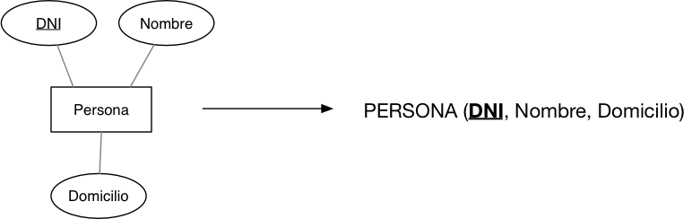
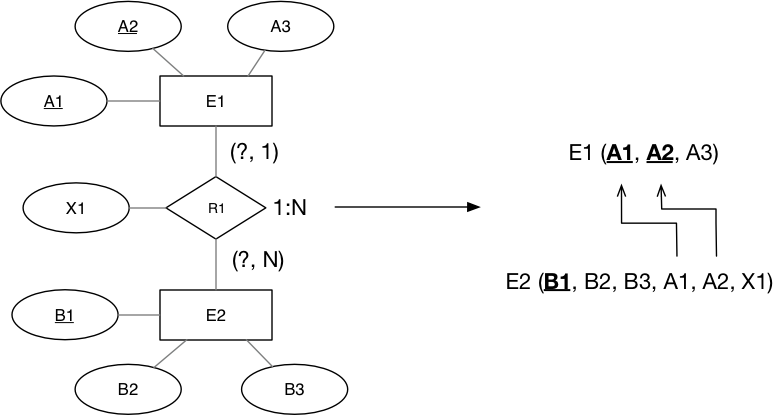

<!-- _class: titlepage -->

Tema 3

El modelo relacional

Grado en Ciencia de Datos e Inteligencia Artificial

Curso 2021/2022

Departamento de Sistemas Informáticos

---
<!-- _class: transition -->
# EL MODELO RELACIONAL

## Modelado lógico de bases de datos

---

# Elementos del modelo relacional

Como modelo de datos que es, el Modelo Relacional consta de tres partes diferentes:

- **Parte Estructural**: Relaciones (también llamadas Tablas).
- **Parte Operativa**: Álgebra Relacional.
- **Parte Semántica**: Restricciones de Integridad

---

# Elementos del modelo (Parte Estructural)

- Proporciona una representación uniforme de la información.
- Acceso a los datos: *navegación lógica*.
- Ventajas:
  - Simplicidad de la estructura.
  - Sencillez en la definición de los operadores.
  - Todas las consultas realizadas son simétricas.
  - La definición del Modelo Relacional está basada en una **base matemática potente**. Es similar a la *Teoría de Conjuntos*.

---

# Elementos del modelo (Parte Estructural)

Las relaciones de este modelo pueden definirse de manera matemática:

$R$ es una relación sobre los conjuntos $D_1,D_2,\ldots,D_n$, si es un subconjunto del producto cartesiano $D_1\times D_2\times \ldots \times D_n$.

Los diferentes conjuntos $D_1,D_2,\ldots,D_n$ sobre los que se define la relación se denominan **dominios**.

---

# Elementos del modelo (Parte Estructural)

- Cada **atributo** de la relación está asociado a un único dominio:
  - Ej: $D_\textrm{COLOR} = \left \{ \textrm{Rojo},\textrm{Negro},\textrm{Azul},\textrm{Verde} \right \}$
  - Los nombres de los atributos que definen una relación no pueden repetirse.
  - Los dominios sí pueden estar repetidos.
- Los elementos que componen una relación se denominan **tuplas**.
- **Grado de una relación**: número de atributos sobre el que se define la relación.
- **Cardinalidad de una relación**: número de tuplas que contiene la relación en un momento dado.

---

# Elementos del modelo (Parte Estructural)

Representación gráfica de una relación:

Representación textual:

$$R \left ( A_1,A_2,\ldots,A_n \right )$$

---

# Esquemas de relación

Toda relación puede definirse de dos formas:

- Por extensión: especificando todas y cada una de las tuplas que componen la relación.
- Por intensión: especificando el esquema de la relación.

**Relación**: Estructura abstracta que define una relación a través de un nombre, un conjunto de atributos y un conjunto de restricciones que caracterizan a esa relación.

$$
r = R(T,L)
$$

donde $R$ es el nombre de la relación $r$, $T$ el conjunto de atributos que definen a $r$ y $L$ el conjunto de restricciones que caracterizan a $r$.

---

# Esquemas de relación

Las restricciones de comportamiento suelen ser de dos tipos:

- Asignación de los atributos a dominios.
- Relaciones entre los atributos.

Concepto de realización de una relación:

Es la asignación de valores al conjunto T de atributos del esquema de relación, de tal forma que se cumplan todas y cada una de las restricciones del conjunto L de restricciones.

---

# Condiciones del modelo (Parte Estructural)

1. Cada tabla debe contener un solo tipo de filas.
2. Una tabla no puede contener filas duplicadas.
3. Cada columna debe estar identificada por un nombre específico.
4. Cada columna tiene que ser única, no pudiendo existir columnas duplicadas.
5. Cada valor en una columna tiene que ser único, no permitiéndose valores múltiples para un atributo.
6. Cada columna debe extraer sus valores de un dominio.
7. Un mismo dominio podrá servir para columnas diferentes.
8. Las filas pueden estar en cualquier orden.
9. Las columnas pueden estar en cualquier orden.

---

# Elementos del modelo (Parte Estructural)

**Base de datos relacional**: Conjunto de relaciones de formato fijo cuyo contenido es variable en el tiempo.

Los atributos serán símbolos tomados de un conjunto finito $\mathbb{U}$ ("universo" del modelo conceptual). Usaremos $A,B,\ldots$ para denotar atributos simples y $V,W,X\ldots$, para designar conjuntos de los mismos o descriptores.

**NOTA**: en adelante denominaremos indistintamente "descriptor" a un atributo simple o a un conjunto de atributos.

---

# Elementos del modelo (Parte Estructural)

En el Modelo Relacional se distingue entre dos tipos de relaciones:

- **Relaciones básicas**: son aquellas relaciones que se definen con independencia del resto de relaciones existentes en la **BD** relacional.
- **Relaciones derivadas**: son aquellas otras relaciones que son resultado de la aplicación de los operadores relacionales sobre las relaciones básicas.

---

# Elementos del modelo (Parte Semántica)

Concepto de *clave* (definición **no** formal): Descriptor mínimo cuyo valor determina de forma unívoca el valor del resto de los atributos de la relación.

- Cada relación tiene **al menos una** clave.
- Si hay varias claves, desde el punto de vista puramente teórico todas son iguales.

En la práctica, es decir, cuando se define la BD relacional en un SGBD, cada clave se denomina *clave candidata*, y una de ellas se elegirá como **CLAVE PRINCIPAL O PRIMARIA**, quedando el resto como **claves alternativas**.

---

# Elementos del modelo (Parte Semántica)

Cada relación tendrá una combinación de atributos que, tomados en conjunto, **identifican de forma única cada tupla**. A esta combinación se la conoce como **CLAVE** de una relación

| DNI | Nombre | Domicilio | Teléfono |
|-----|--------|-----------|----------|
| 321 | Pepe   | Aquí      | 987      |
| 134 | Pepe   | Allí      | 789      |
| 123 | Juan   | Allí      |          |

¿Cuál será la clave para esta relación?

---

# Elementos del modelo (Parte Semántica)

**Requisito obligatorio**: Toda relación debe contar con **al menos una clave**.

- Tipos de claves
  - Principal o primaria
  - Secundarias o alternas
  - Foráneas o externas
  - Simples (formadas por un único atributo)
  - Compuestas (formadas por más de un atributo)

---

# Elementos del modelo (Parte Semántica)

Restricciones semánticas del modelo relacional:

1. **Restricción de Integridad de Entidad**. Ningún valor de la clave primaria de una relación puede ser nulo o tener algún componente nulo. Asimismo, una clave primaria no admite valores repetidos.
2. **Restricción de Integridad de Dominio**. Un atributo no puede tomar valores que excedan del rango asociado.
3. **Restricción de Integridad Referencial**: Cualquier atributo de una relación que sea declarado como clave foránea solo puede contener valores nulos o valores existentes que provienen, o bien de la clave primaria o bien de una clave candidata de la relación a la que referencia. En otras palabras, si un atributo que es clave foránea toma un determinado valor, dicho valor tiene que existir ya sea como clave primaria o candidata en la relación a la que referencia dicha clave foránea.

---

Ejemplo:

PROVEEDORES (**COD_PROV**, NOMBRE)
ARTÍCULOS (**COD_ART**, DESCRIPCIÓN)
SUMINISTROS (**COD_PROV**, **COD_ART**, CANTIDAD, **FECHA**)

Si en `SUMINISTROS` existe la tupla: (**P2**, **A012**, 1000, **13/01/98**)

Por la restricción de integridad referencial *es obligatorio* que en `PROVEEDORES` exista una tupla tal que **COD_PROV**=**P2**. Así mismo, en la relación `ARTICULOS` deberá existir otra tupla en la que se verifique **COD_ART**=**A012**

**Conclusión**: no podrá existir una tupla en la relación `SUMINISTROS` en la que figure un código de proveedor o un código de artículo que no existan previamente en sus respectivas relaciones de `PROVEEDORES` y `ARTICULOS`.

---
<!-- _class: transition -->
# PASO A TABLAS (ER $\rightarrow$ RELACIONAL)

---

# Paso a tablas: Entidades

1. Toda **entidad** se corresponde con una relación.
2. Los atributos de la entidad se transforman en atributos de la relación.
3. Los atributos de la clave de la entidad son los atributos de la clave de la relación.

---

# Paso a tablas: Relaciones N:M

Siempre se transforman en una tabla, incluyendo tanto los atributos de la relación N:M como las claves de las entidades relacionadas.

---

# Paso a tablas: Relaciones 1:N

Añadir la clave de la entidad de la parte "uno" de la relación a la relación de la entidad de la parte "muchos", además de los atributos que tenga la relación 1:N

---

# Paso a tablas: Relaciones 1:1

- Si la cardinalidad mínima es **igual** en ambos extremos de la relación, se añade la clave de una de las entidades a la entidad restante, incluyendo los atributos de la relación si los hubiere.
- Si la cardinalidad mínima es **diferente** en los extremos de la relación, se añade la clave de la entidad *"uno"* a la tabla de la entidad *"cero"*.

---

# Paso a tablas: Relaciones n-arias

Estudiar las relaciones de dos en dos y aplicar las reglas de relaciones binarias. **OJO**, se puede mejorar el diseño estudiando redundancias.

---

# Paso a tablas: Ejemplo completo

Dado el siguiente modelo ER, transformarlo al modelo relacional:

---

# Paso a tablas: Ejemplo completo (solución)

---
<!-- _class: transition -->
# ÁLGEBRA RELACIONAL

---

# Introducción

Lenguajes de acceso a bases de datos relacionales:

- Álgebra Relacional
  - Lenguaje procedimental (se indica qué y cómo obtenerlo)
- Cálculo Relacional
  - Lenguaje no procedimental (se indica qué pero no cómo obtenerlo)
  - Dos tipos: Orientado a Tuplas y Orientado a Dominios

Álgebra y Cálculo Relacional son equivalentes en poder expresivo.

---

# Álgebra Relacional y sus operadores

El **Álgebra Relacional** es un conjunto cerrado de operaciones que:

- Actúan sobre relaciones
- Producen relaciones como resultados
- Pueden combinarse para construir expresiones más complejas

**Operadores básicos**: Unión, Diferencia, Producto Cartesiano, Selección, Proyección.

**Operadores derivados**: Intersección, Join, División, Asociación

---

# Unión $R \cup S$

- La unión de dos relaciones $R$ y $S$, es otra relación que contiene las tuplas que están en $R$, o en $S$, o en ambas, eliminándose las tuplas duplicadas.
- $R$ y $S$ **deben ser unión-compatible**, es decir, definidas sobre el mismo conjunto de atributos.

---

# Diferencia $R - S$

- La diferencia de dos relaciones $R$ y $S$, es otra relación que contiene las tuplas que están en la relación $R$, pero no están en $S$.
- $R$ y $S$ **deben ser unión-compatible**.

---

# Producto cartesiano $R \times S$

- Define una relación que es la concatenación de cada una de las filas de la relación $R$ con cada una de las filas de la relación $S$.

---

# Selección $\sigma_\textrm{predicado} (R)$

- Es un operador unario.
- Define una relación con los mismos atributos que $R$ y que contiene solo aquellas filas de $R$ que satisfacen la condición especificada (predicado).

---

# Proyección $\prod_{col_1,\ldots,col_n}(R)$

- Es un operador unario.
- Define una relación que contiene un subconjunto vertical de $R$ con los valores de los atributos especificados, eliminando filas duplicadas en el resultado.

---

# Intersección $R\cap S$

- Define una relación que contiene el conjunto de todas las filas que están tanto en la relación $R$ como en $S$.
- $R$ y $S$ deben ser unión-compatible.
- Equivalencia con operadores básicos:
$R\cap S=R-(R-S)$

---

# División $R\div S$

- Relación sobre el conjunto de atributos $C\subset R$ con las tuplas de $R$ que están combinadas con cada una de las tuplas de $S$.
- Condiciones:
  - $\textrm{grado}(R) > \textrm{grado} (S)$
  - $\textrm{atributos}(S) \subset \textrm{atributos}(R)$
- Equivalencia con operadores básicos:
  - $X_1=\prod_C(R)$
  - $X_2=\prod_C((S\times X_1)-R)$
  - $R\div S=X_1-X_2$

---

# Ejemplo de división

---

# Unión natural (Natural Join) $R\Join S$ o $R * S$

- El resultado es una relación con los atributos de ambas relaciones y se obtiene combinando las tuplas de ambas relaciones que tengan el mismo valor en los atributos comunes.
- Normalmente la operación de join se realiza entre los atributos comunes de dos tablas que corresponden a la clave primaria de una tabla y la clave foránea correspondiente de la otra tabla.
- Método:
  - Se realiza el producto cartesiano $R\times S$.
  - Se seleccionan aquellas filas del producto cartesiano para las que los atributos comunes tengan el mismo valor.
- Se elimina del resultado una ocurrencia (columna) de cada uno de los atributos comunes.
- Equivalencia con operadores básicos: $R\Join_F S=\sigma_F(R\times S)$.

---

# Outer Join

- Es una variante del `Join` en la que se intenta mantener toda la información de los operandos, incluso para aquellas filas que no participan en el `Join`.
- Se *rellenan con nulos* las tuplas que no tienen correspondencia en el `Join`.
- Tres variantes:
  - $\Join_{\textrm{LEFT}}$: se tienen en cuenta todas las filas del primer operando.
  - $\Join_{\textrm{RIGHT}}$: se tienen en cuenta todas las filas del segundo operando.
  - $\Join_{\textrm{FULL}}$: se tienen en cuenta todas las filas de ambos operandos.

---

# Ejemplos de Join

---

# Asociación $R\Join_F S$ o $R *_F S$

- Define una relación que contiene las tuplas que satisfacen el predicado $F$ en el producto cartesiano $R\times S$.
- El predicado $F$ es de la forma $R.a_i \theta S.b_i$ donde $\theta$ representa un operador de comparación:
$(<, \leq, >, \geq, =, \neq)$.
- El predicado no tiene por que definirse sobre atributos comunes.
- **Equijoin**: Si el predicado $F$ contiene únicamente el operador de igualdad.

---

# Base de datos para los ejemplos

---

# Ejemplos (I)

Obtener los apellidos y teléfono de los alumnos de nombre Rosa

$$\prod_{\textrm{apellidos},\textrm{telefono}} (\sigma_{\textrm{nombre}='\textrm{Rosa}'}(Alumnos))$$

|Apellidos  |Telefono|
|-----------|--------|
|López López|1113344 |

---

# Ejemplos (II)

Obtener las notas obtenidas en la asignatura de Inglés

$$\prod_{\textrm{nombre},\textrm{apellidos},\textrm{nota}}(\sigma_{\textrm{nombreA}='\textrm{Inglés}'}(Alumnos\Join Notas\Join Asignaturas))$$

|Nombre|Apellidos    |Nota|
|------|-------------|----|
|Ana   |Pérez Gómez  |7   |
|Juan  |García García|5   |

---

# Ejemplos (III)

Obtener los alumnos que figuren matriculados en todas las asignaturas

$$\prod_{\textrm{Nmat},\textrm{codA}}(Notas)\div\prod_{\textrm{codA}}(Asignaturas)$$

|Nmat|
|----|
|0338|
|0168|

---

# Ejemplos (III)

Otra alternativa:
$$\prod_{\textrm{nombre},\textrm{apellidos}}(Alumnos\Join (\prod_{\textrm{Nmat},\textrm{codA}}(Notas)\div \prod_{\textrm{codA}}(Asignaturas)))$$

|Nombre|Apellidos    |
|------|-------------|
|Ana   |Pérez Gómez  |
|Juan  |García García|

---

# Ejemplos (IV)

Obtener los alumnos que figuren matriculados en las asignaturas de Inglés y Dibujo

$$\prod_{\textrm{Nmat}}(\sigma_{\textrm{nombreA}='\textrm{Inglés}'}(Asignaturas)\Join Notas) \bigcap \prod_{\textrm{Nmat}}(\sigma_{\textrm{nombreA}='\textrm{Dibujo}'}(Asignaturas)\Join Notas)$$

|Nmat|
|----|
|0338|
|0168|

---

# Ejemplos (V)

Obtener los alumnos que no han suspendido ninguna asignatura

$$\prod_{\textrm{Nmat}}(\sigma_{\textrm{nota}\geq 5}(Notas))-\prod_{\textrm{Nmat}}(\sigma_{\textrm{nota}<5}(Notas))$$

|Nmat|
|----|
|0338|
|0254|
