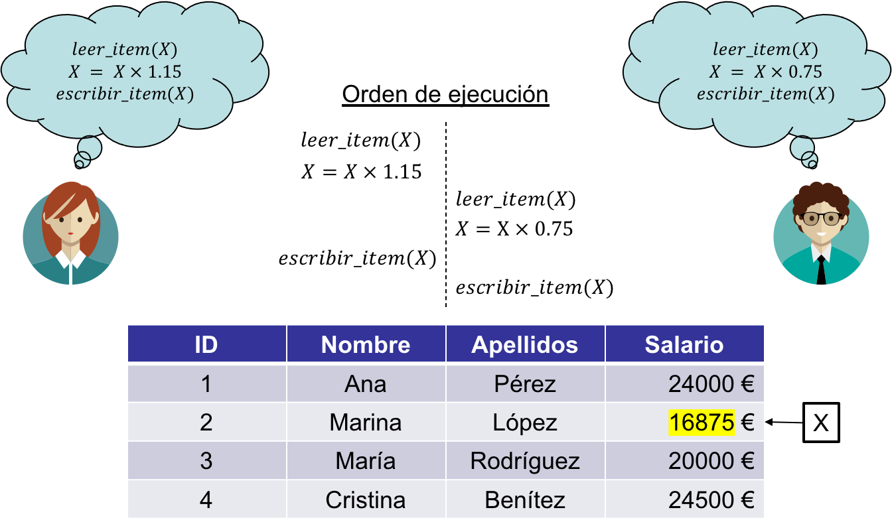
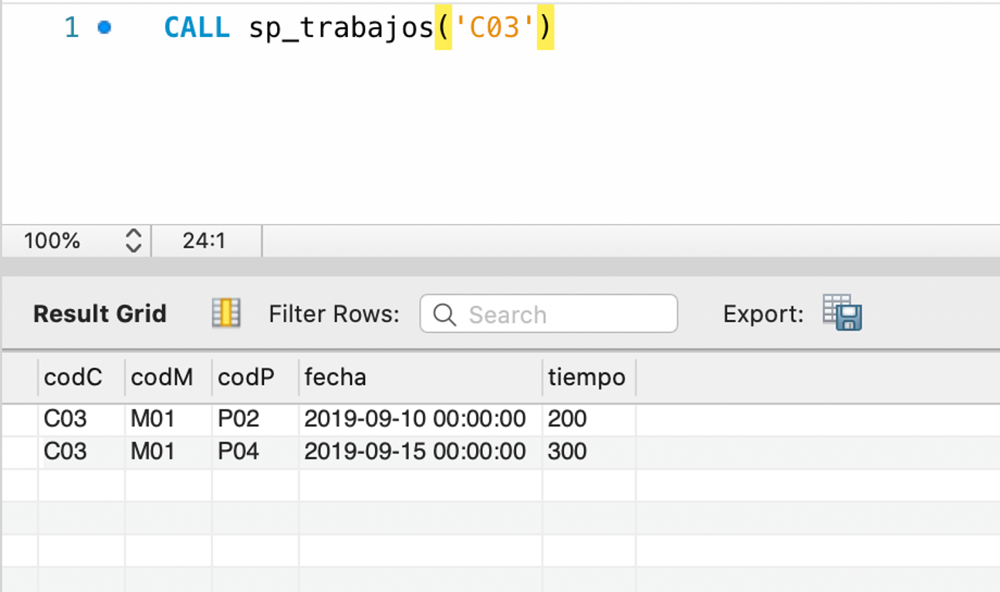
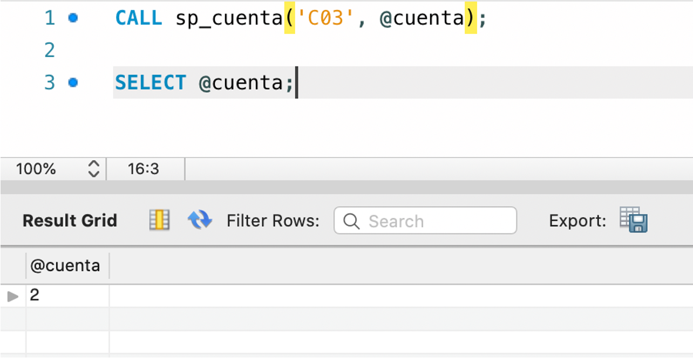
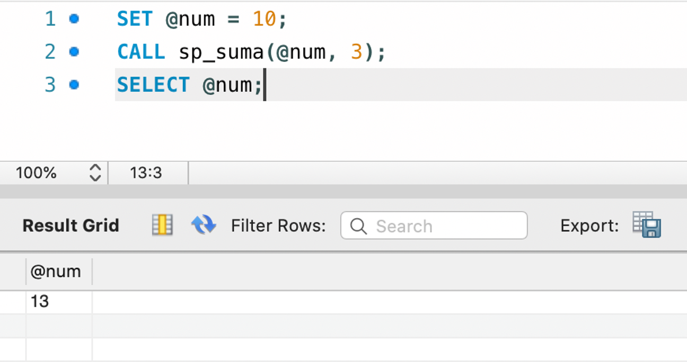
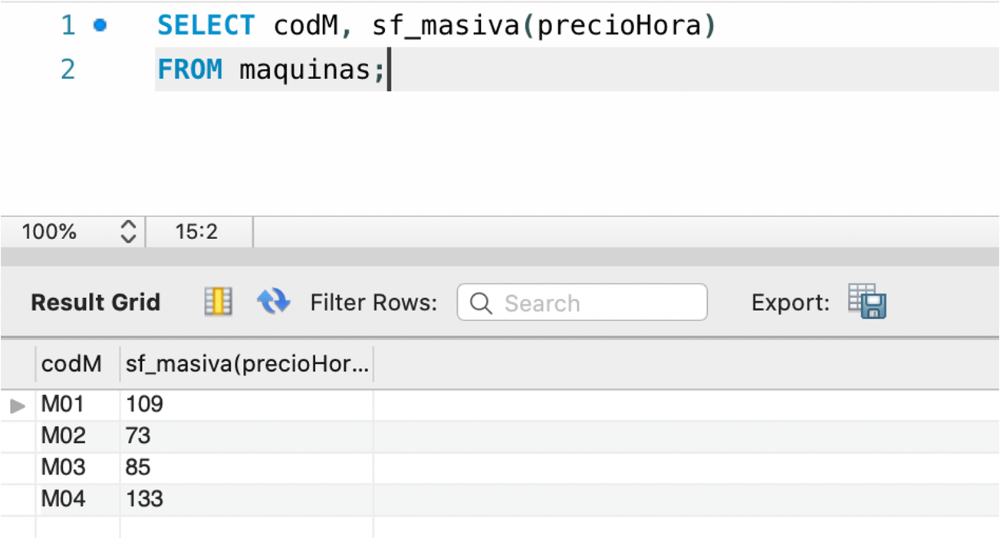
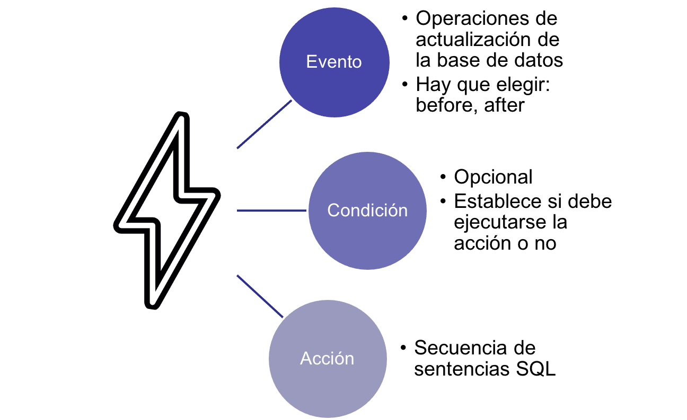

<style>

   .cite-author {
      text-align        : right;
   }
   .cite-author:after {
      color             : orangered;
      font-size         : 125%;
      font-weight       : bold;
      font-family       : Cambria, Cochin, Georgia, Times, 'Times New Roman', serif;
      padding-right     : 130px;
   }
   .cite-author[data-text]:after {
      content           : " - "attr(data-text) " - ";
   }

   .cite-author p {
      padding-bottom : 40px
   }

  s {text-decoration: underline; background-color: transparent}

  td {font-size: 0.8rem}
  thead {font-size: 0.8rem}

</style>

<!-- _class: titlepage -->


<div class="title">Tema 5</div>
<div class="subtitle">Gestión de bases de datos</div>
<div class="author">Grado en Ciencia de Datos e Inteligencia Artificial</div>
<div class="date">Curso 2021/2022</div>
<div class="organization">Departamento de Sistemas Informáticos</div>

[](https://creativecommons.org/licenses/by-nc-sa/4.0/)

---
<!-- _class: transition -->

# GESTIÓN DE BASES DE DATOS

## Transacciones

---

# Transacciones: el problema

- Por la experiencia con las prácticas, tendemos a pensar que los SGBD son aplicaciones mono-usuario.
- Sin embargo, uno de las ventajas de los SGBD es el acceso concurrente a los datos por parte de multitud de usuarios.

<center>


</center>

---

# Transacciones: el problema

Para entender el problema que motiva el uso de transacciones, vamos a realizar varias suposiciones:

- Una **base de datos** se representa básicamente como una colección de elementos de datos con nombres:

$$\{A,B,X,Y,\ldots\}$$

- Se definen dos operaciones:
  - $\mathtt{leer\_item}(X)$: Lee un elemento de la base de datos llamado $X$ en una variable $X$ del programa.
  - $\mathtt{escribir\_item}(X)$: Escribe el valor de la variable de programa $X$ en el elemento de la base de datos llamado $X$.

---

# Problema de la actualización perdida

<center>


</center>

---

# Problema de la actualización perdida

<center>


</center>

---

# Problema de la actualización perdida

<center>


</center>

El elemento X tiene un valor incorrecto porque su actualización se pierde (se sobrescribe).

---

# Problema de la lectura sucia

<center>


</center>

---

# Problema de la lectura sucia

<center>


</center>

Se ha leído un valor de X que no es el correcto, pues se debería haber restaurado tras el error.

---

# Problema del resumen incorrecto

<center>


</center>

---

# Problema del resumen incorrecto

<center>


</center>

Se ha leído un valor inconsistente de $Y$, ya que la lectura se ha adelantado a la actualización de su valor.

---

# Cómo evitar los errores anteriores

Se podrían agrupar varias instrucciones de lecturas y escrituras de forma que se ejecuten de forma *atómica*:

<center>


</center>

---

# Cómo evitar los errores anteriores

La ejecución de un conjunto de operaciones debe dejar la base de datos en un estado *consistente*:

<center>


</center>

---

# Cómo evitar los errores anteriores

Las instrucciones agrupadas deberían ejecutarse de manera *aislada*, de forma que dos conjuntos de instrucciones que no dependan entre sí, se ejecutarían simultáneamente:

<center>


</center>

---

# Cómo evitar los errores anteriores

Los cambios realizados por las operaciones deben ser *duraderos*, de forma que no les afecten los fallos:

<center>


</center>

---

# Propiedades deseables: ACID

- **~~A~~tomicity**: Instrucciones se ejecutan de manera autónoma
- **~~C~~onsistency**: Los cambios deben dejar la base de datos en un estado consistente
- **~~I~~solation**: Las instrucciones se ejecutan de manera aislada, sin interdependencias
- **~~D~~urability**: Los cambios realizados deben ser durables en el tiempo y tolerantes a fallos

Estas propiedades deben cumplirse en un SGBD para evitar los errores relacionados con el acceso concurrente a los datos.

---

# ¿Qué es una transacción?

- Es una agrupación de operaciones sobre una base de datos que se ejecutan de forma **atómica**, **aislada**, mantienen la **consistencia** de la base de datos y los cambios realizados son **duraderos**.
- En otras palabras, cumple con las propiedades ACID descritas anteriormente.
- El lenguaje SQL nos permite agrupar consultas como transacciones, además de ejecutarlas, confirmarlas y deshacerlas en caso de error.

---

# Estados de una transacción


Imagen extraída de “*Fundamentals of Database Systems*”, Elmasri, Navathe.

---

# SQL para transacciones

Empezar una transacción:

```SQL
START TRANSACTION [opción1, opción2, ...]
-- Alternativa
BEGIN [WORK]
```

Las opciones que se pueden establecer para la transacción:

```SQL
WITH CONSISTENT SNAPSHOT -- Lecturas consistentes
READ WRITE -- Transacción de lectura/escritura
READ ONLY -- Prohíbe operaciones de escritura
```

---

# SQL para transacciones

Confirmar los cambios de una transacción

```SQL
COMMIT [WORK] [AND [NO] CHAIN] [[NO] RELEASE]
```

- `CHAIN`: Abre una nueva transacción inmediatamente a continuación de que se complete ésta.
- `RELEASE`: Desconecta el cliente tan pronto se ejecuta la transacción.

Deshacer los cambios de una transacción:

```SQL
ROLLBACK [WORK] [AND [NO] CHAIN] [[NO] RELEASE]
```

---

# Ejemplos de transacciones

Lectura de un valor y, a continuación, escritura del valor leído:

```SQL
START TRANSACTION;
SELECT @A:=SUM(salary) FROM table1 WHERE type=1;
UPDATE table2 SET summary=@A WHERE type=1;
COMMIT;
```

Transferencia de dinero entre cuentas bancarias:

```SQL
START TRANSACTION;
UPDATE sb_accounts
SET balance = balance - 1000
WHERE account_no = 932656;
UPDATE ca_accounts
SET balance = balance + 1000
WHERE account_no = 933456 ;
COMMIT;
```

---

# Confirmación automática

- En MySQL, las transacciones se confirman de forma automática.
- Es decir, cada consulta ejecutada se convierte en una transacción y se confirma automáticamente.
- Se puede activar/desactivar este comportamiento con la siguiente consulta:

```SQL
SET autocommit = {0 | 1}
```

---

# Control de la concurrencia

- Los SGBD ejecutan transacciones de manera concurrente.
- Esto da lugar a los problemas asociados a la concurrencia.
- Una forma de solucionar dichos problemas es mediante el uso de bloqueos:.
  - Bloqueos de lectura y escritura.
  - Bloqueo en dos fases.
  - Bloqueo optimista y pesimista.

---

# Bloqueos para lectura y escritura

- Tres nuevas operaciones:
  - $\mathtt{read\_lock}(X)$
  - $\mathtt{write\_lock}(X)$
  - $\mathtt{unlock}(X)$
- Los bloqueos para lectura se pueden simultanear.
- El bloqueo para escritura es restrictivo.
- El desbloqueo de un objeto depende del tipo de bloqueo que tiene.

---

# Bloqueo para lectura

<center>


</center>

---

# Bloqueo para escritura

<center>


</center>

- Si el objeto está desbloqueado, se bloquea el mismo para escritura.
- Si el objeto está bloqueado, se espera a que quede libre antes de bloquearlo para escritura.

---

# Desbloqueo

<center>


</center>

- Si el bloqueo era por **lectura**, se decrementa en 1 el número de lecturas.
- Si el número de lecturas **llega a 0**, se establece que el objeto queda desbloqueado y se notifica a los bloqueos que esperan.
- Si el bloqueo era por **escritura**, se desbloquea el objeto y se notifica a los bloqueos que estaban esperando.

---

# Bloqueo en dos fases

Para garantizar la ejecución en serie de las transacciones se realiza un **bloqueo en dos fases**:

- *Fase de crecimiento*: se realizan todos los bloqueos de los objetos que se vayan a utilizar en la transacción.
- *Fase de liberación*: se liberan aquellos bloqueos solicitados durante la fase anterior.

---

# Bloqueo pesimista y optimista

- Bloqueo pesimista:
  - Transacciones completamente separadas
  - Serializable (nivel de aislamiento)
  - Problema: Interbloqueo (prevención por grafos)
- Bloqueo optimista:
  - Asume que no habrá errores
  - Cuando se modifican los datos, se vuelven a leer y si hay modificaciones se produce un error
  - El programa debe solucionarlo

---
<style scoped>
  li {font-size: 0.9rem}
  pre {font-size:0.7rem}
  h2 {font-size: 1rem}
  p {font-size: 0.9rem}
</style>

# Niveles de aislamiento

```SQL
SET [{GLOBAL | SESSION}] TRANSACTION
  {ISOLATION LEVEL nivel | {READ WRITE | READ ONLY}}
```

Parámetros:

- `GLOBAL|SESSION`: Se aplica a todas las sesiones o a la sesión actual, respectivamente.

Niveles:

- `REPEATABLE READ`: **Nivel por defecto**. Establece lectura consistente: dentro de una misma transacción las lecturas se realizan sobre el conjunto inicial de datos. No bloquea.
- `READ COMMITTED`: Cada lectura establece su propio conjunto de datos incluso dentro de la misma transacción. No bloquea.
- `READ UNCOMMITTED`: Son lecturas sucias. Pueden leerse versiones no cambiadas de filas ya cambiadas.
- `SERIALIZABLE`: Establece bloqueo compartido solo para lectura con otras sesiones (como repeatable-read pero compartido).

---
<!-- _class: transition -->

# GESTIÓN DE BASES DE DATOS

## Procedimientos y funciones almacenados

---

# Procedimientos almacenados

- Un procedimiento almacenado es una subrutina que se almacena en una base de datos.
- Esta subrutina es similar a un subprograma en cualquier otro lenguaje de programación.
- Un procedimiento cuenta con un nombre, una lista de parámetros y sentencias SQL.
- Ventajas:
  - Son rápidos, ya que el SGBD se aprovecha de técnicas de cacheado. Además, se evita el tráfico de red.
  - Son portables. Los procedimientos creados en una base de datos se pueden mover a otro servidor.
  - Siempre están disponibles como código fuente en la propia base de datos.

---

# Creación de un procedimiento

```SQL
CREATE PROCEDURE nombre ([parámetro[,...]])
BEGIN
  cuerpo
END
```

Los parámetros tienen la siguiente sintaxis:

```SQL
[ IN | OUT | INOUT ] param_name type
```

El cuerpo del procedimiento estará formado por **sentencias SQL válidas**.

---

# Procedimientos: ejemplo

```SQL
DELIMITER $$
CREATE PROCEDURE sp_conductores()
BEGIN
    SELECT * FROM conductores;
END$$
DELIMITER ;
```

Es **importante** cambiar el carácter delimitador de final de línea que tiene por defecto SQL para que el cuerpo del procedimiento no se interpreten como sentencias SQL independientes. Para ello usamos el operador `DELIMITER`.

---

# Procedimientos: ejemplo

<center>


</center>

---

# Parámetros del procedimiento

Los parámetros de un procedimiento pueden ser de entrada, salida o entrada/salida:

- `IN`: El procedimiento puede modificar el valor, pero la modificación no es visible para el invocador cuando el procedimiento acaba (por defecto).
- `OUT`: Su valor inicial es NULL dentro del procedimiento, y su valor es visible para el invocador cuando el procedimiento acaba.
- `INOUT`: El parámetro se inicializa en la llamada, puede ser modificado por el procedimiento, y cualquier cambio hecho por el procedimiento es visible tras la ejecución.

---

# Ejemplo: parámetro de entrada

```SQL
DELIMITER $$
CREATE PROCEDURE sp_trabajos(IN conductor varchar(3))
BEGIN
    SELECT *
    FROM trabajos
    WHERE codC = conductor;
END$$
DELIMITER ;

CALL sp_trabajos('C03')
```

---

# Ejemplo: parámetro de entrada

<center>


</center>

---

# Ejemplo: parámetro de salida

```SQL
DELIMITER $$
CREATE PROCEDURE sp_cuenta(IN conductor varchar(3),
                           OUT num_trabajos integer)
BEGIN
    SELECT count(*) INTO num_trabajos
    FROM trabajos
    WHERE codC = conductor;
END$$
DELIMITER ;

CALL sp_cuenta('C03', @cuenta);

SELECT @cuenta;
```

---

# Ejemplo: parámetro de salida

<center>


</center>

---

# Ejemplo: parámetro de entrada/salida

```SQL
DELIMITER $$
CREATE PROCEDURE sp_suma(INOUT inicial integer,
                         IN cantidad integer)
BEGIN
    SET inicial = inicial + cantidad;
END$$
DELIMITER ;

SET @num = 10;

CALL sp_suma(@num, 3);

SELECT @num;
```

---

# Ejemplo: parámetro de entrada/salida

<center>


</center>

---

# Variables y variables de usuario

Ya hemos visto cómo se declaran variables de usuario: anteponiendo una `@` delante del nombre:

```SQL
SET @mi_var = 10; -- Asignar valor
SELECT @mi_var;   -- Consultar valor
```

Se pueden declarar variables locales en los procedimientos usando `DECLARE`:

```SQL
DECLARE var_name [, var2, ...] tipo [DEFAULT valor]
```

---

# Ejemplo: variables locales

```SQL
DELIMITER $$
CREATE PROCEDURE sp_division()
BEGIN
    DECLARE num_maquinas INTEGER;
    SELECT COUNT(codM) INTO num_maquinas
    FROM maquinas;

    SELECT codP
    FROM trabajos
    GROUP BY codP
    HAVING count(distinct codM) = num_maquinas;
END$$
DELIMITER ;
```

Si hay **varias consultas** en el cuerpo de un procedimiento, se devuelve **el último resultado**.

---

# Sentencias de control de flujo

SQL soporta varias sentencias para controlar el flujo de ejecución de los procedimientos:

- `IF`
- `CASE`
- `ITERATE`
- `LEAVE`
- `LOOP`
- `WHILE`
- `REPEAT`

---

# Sentencia `IF`

```SQL
IF condition THEN statement
[ELSEIF condition THEN statement(s)] ...
[ELSE statement(s)]  
END IF
```

Evalúa condición y ejecuta las sentencias correspondientes. Se pueden encadenar condiciones con `ELSEIF`.

---
<style scoped>
  pre {font-size:0.75rem}
  p {font-size: 0.8rem}
</style>

# Sentencia `CASE`

```SQL
CASE case_value
WHEN when_value THEN statement_list
...
[ELSE statement_list]
END CASE
```

Evalúa la expresión y ejecuta las sentencias acorde al resultado obtenido.

Sintaxis alternativa:

```SQL
CASE
WHEN search_condition THEN statement_list
..
[ELSE statement_list]
END CASE
```

Se va evaluando cada condición de búsqueda hasta que una es cierta. En caso contrario se ejecuta el fragmento del `ELSE`.

---

# Bucle `LOOP`

```SQL
begin_label:
LOOP
statement_list
IF condicion THEN
  LEAVE begin_label;
END IF;
END LOOP;
[end_label]
```

Se ejecutan las sentencias **hasta que se abandone el bucle con `LEAVE`**.

---

# Ejemplo: bucle `LOOP`

```SQL
DELIMITER $$
CREATE PROCEDURE `my_proc_LOOP` (IN num INT)
BEGIN
    DECLARE x INT;
    SET x = 0;
    loop_label: LOOP
        INSERT INTO number VALUES (rand());
        SET x = x + 1;
        IF x >= num THEN
            LEAVE loop_label;
        END IF;
    END LOOP;
END$$
DELIMITER ;
```

---

# Bucle `REPEAT`

```SQL
[begin_label:]
REPEAT
    statement_list
UNTIL search_condition
END REPEAT
[end_label]
```

Las sentencias se repiten hasta que la condición se cumpla. Ambas etiquetas son opcionales en este tipo de bucle.

---

# Ejemplo: bucle `REPEAT`

```SQL
DELIMITER $$
CREATE PROCEDURE my_proc_REPEAT (IN n INT)
BEGIN
    SET @sum = 0;
    SET @x = 1;  
    REPEAT
        IF mod(@x, 2) = 0 THEN
            SET @sum = @sum + @x;
        END IF;
        SET @x = @x + 1;
    UNTIL @x > n
    END REPEAT;
END $$
DELIMITER ;
```

---

# Bucle `WHILE`

```SQL
[begin_label:]
WHILE search_condition DO
    statement_list
END WHILE
[end_label]
```

Se ejecutan las instrucciones mientras se cumple la condición. Similar al `REPEAT` pero con la condición de parada invertida.

---

# Ejemplo: bucle `WHILE`

```SQL
DELIMITER $$
CREATE PROCEDURE my_proc_WHILE(IN n INT)
BEGIN
    SET @sum = 0;
    SET @x = 1;
    WHILE @x<=n DO
        IF mod(@x, 2) <> 0 THEN
            SET @sum = @sum + @x;
        END IF;
        SET @x = @x + 1;
    END WHILE;
END$$
DELIMITER ;
```

---
<!-- _class: transition -->

# GESTIÓN DE BASES DE DATOS

## Funciones almacenadas

---

# Funciones almacenadas

- Al igual que con los procedimientos, MySQL admite funciones almacenadas.
- Son subrutinas que se almacenan en la base de datos pero que devuelven un valor cuando son ejecutadas.
- Por ello, se pueden usar como expresiones en cualquier consulta, condición, etc.

---

# Sintaxis de creación de funciones

```SQL
DELIMITER $$
CREATE FUNCTION function_name(
    param1,
    param2, …
)
RETURNS datatype
DETERMINISTIC
BEGIN
    statements;
    RETURN (value);
END $$
DELIMITER ;
```

Es necesario especificar que la función es `DETERMINISTIC` (determinista) para que el optimizador del SGBD haga su trabajo correctamente.

---

# Ejemplo: función

```SQL
DELIMITER $$
CREATE FUNCTION sf_masiva(cantidad DECIMAL)
RETURNS DECIMAL
DETERMINISTIC
BEGIN
    DECLARE cmasiva DECIMAL;
    SET cmasiva = cantidad * 1.21;
    RETURN (cmasiva);
END$$
DELIMITER ;
```

---

# Ejemplo: función

<center>


</center>

---
<!-- _class: transition -->

# GESTIÓN DE BASES DE DATOS

## Cursores

---

# Cursor

- Un cursor es una estructura de control que permite recorrer secuencialmente los resultados de una consulta.
- En otras palabras, es un iterador sobre las filas resultantes de ejecutar una consulta.
- Se suelen utilizar en subrutinas almacenadas en la base de datos, como procedimientos y funciones.

---

# Operaciones con cursores

```SQL
CREATE PROCEDURE curdemo()
BEGIN
  DECLARE done INT DEFAULT FALSE;
  DECLARE b, c INT;
  DECLARE cur1 CURSOR FOR SELECT id, data FROM t1; -- Creación
  DECLARE CONTINUE HANDLER FOR NOT FOUND SET  done = TRUE;
  OPEN cur1; -- Apertura
  read_loop: LOOP
    FETCH cur1 INTO b, c; -- Uso
    IF done THEN
      LEAVE read_loop;
    END IF;
  END LOOP;
  CLOSE cur1; -- Cierre
END;
```

---

# Cursores: detalles importantes

El número (y tipos) de variables donde almacenar el resultado de `FETCH` se corresponde con el número (tipo) de columnas devueltas por la consulta que alimenta el cursor:

```SQL
DECLARE cur1 CURSOR FOR SELECT id,data FROM t1;
FETCH cur1 INTO b, c;
```

Hay que declarar un manejador especial para cuando se alcance el final del cursor en un `FETCH`:

```SQL
DECLARE CONTINUE HANDLER FOR NOT FOUND sentencias;
```

**No olvidar** que los cursores **se abren antes de su uso** y **se cierran al acabar**.

---
<!-- _class: transition -->

# GESTIÓN DE BASES DE DATOS

# Triggers

---

# ¿Por qué?

- En ocasiones es necesario comprobar una serie de restricciones en los datos de manera periódica.
- Una posible solución es realizar una comprobación ‘activa’, consultando periódicamente a la base de datos.
- Otra solución más eficiente pasaría por utilizar un sistema basado en eventos y realizar la comprobación cuando se dispare.

---

# ¿Qué eventos suceden en una BBDD?

Durante el uso de una BBDD, pueden ocurrir diferentes eventos que requieran volver a comprobar las restricciones de las que hablábamos:

- Se insertan nuevas filas en una tabla.
- Se modifica el valor de algún atributo de una o varias filas.
- Se eliminan filas de alguna tabla.

---

# Caso de estudio

Una empresa quiere garantizar que un empleado nunca gane más dinero que su supervisor.

Se plantea programar una consulta que obtenga los salarios de empleados y supervisores directos

¿Se te ocurre una manera mejor?

---

# Modelo basado en eventos

<center>


</center>

---

# Composición de un Trigger

<center>


</center>

---

# SQL Trigger

```SQL
DELIMITER //
CREATE TRIGGER upd_check BEFORE UPDATE ON account
FOR EACH ROW
BEGIN
    IF NEW.amount < 0 THEN
        SET NEW.amount = 0;
    ELSEIF NEW.amount > 100 THEN
        SET NEW.amount = 100;
    END IF;
END;//
DELIMITER ;
```

---

# Eventos `BEFORE`y `AFTER`

Los eventos `BEFORE` se ejecutan antes de que se lleve a cabo el evento en cuestión:

- `BEFORE INSERT`
- `BEFORE UPDATE`
- `BEFORE DELETE`

Los eventos `AFTER` se ejecutan una vez se ha producido el evento:

- `AFTER INSERT`
- `AFTER UPDATE`
- `AFTER DELETE`

---

# Variables `NEW` y `OLD`

Una característica interesante de los triggers son las variables `NEW` y `OLD`:

- `NEW.columna` es el nuevo valor que se le va a asignar a la columna en cuestión (para eventos UPDATE e INSERT)
- `OLD.columna` es el valor que tenía la columna en cuestión que se modifica (para eventos UPDATE y DELETE)

---

# Variables `NEW` y `OLD`

```SQL
DELIMITER //
CREATE TRIGGER t1 BEFORE UPDATE ON account
FOR EACH ROW
BEGIN
    IF NEW.amount < 0 THEN
        SET NEW.amount = 0;
    ELSEIF NEW.amount > 100 THEN
        SET NEW.amount = 100;
    END IF;
END;//
DELIMITER ;
```

- Se pueden modificar las variables `NEW` para cambiar los valores a insertar/modificar en base a unas condiciones.
- Las variables `OLD` solo se pueden leer.

---

# Orden de ejecución de los Triggers

- Se pueden definir varios triggers sobre el mismo evento y objeto.
- Es posible especificar el orden de ejecución en el momento de creación del trigger.

```SQL
CREATE TRIGGER ins_transaction BEFORE INSERT ON account
FOR EACH ROW PRECEDES ins_sum
...

CREATE TRIGGER ins_ttt BEFORE INSERT ON account
FOR EACH ROW FOLLOWS ins_transaction
...
```

---

# Algunos ejemplos

Forzar el cumplimiento de una determinada restricción:

```SQL
DELIMITER $$
CREATE TRIGGER no_futuro
BEFORE INSERT ON alumno
FOR EACH ROW
BEGIN
  IF NEW.fecha_nac > CURRENT_DATE()
  THEN
   SIGNAL SQLSTATE '02000'
   SET MESSAGE_TEXT = 'Error: no aceptamos alumnos del futuro';
  END IF;
END$$
DELIMITER ;
```

Presta atención a la forma de lanzar una excepción en MYSQL.

---

# Algunos ejemplos

Corregir valores inusuales o fuera de rango en consultas de inserción y/o modificación:

```SQL
DELIMITER $$
CREATE TRIGGER trigg1
BEFORE UPDATE ON usuario
FOR EACH ROW
BEGIN
  IF NEW.edad < 0 THEN
   SET NEW.edad = 0
  END IF;
END$$
DELIMITER ;
```

---

# Algunos ejemplos

Llevar un registro de los elementos que se borran en la base de datos:

```SQL
DELIMITER $$
CREATE TRIGGER trigg1
AFTER DELETE ON tabla
FOR EACH ROW
BEGIN
  INSERT INTO deletelog (usuario, idborrado, fecha)
  VALUES (USER(), OLD.id, NOW())
END$$
DELIMITER ;
```

---
<!-- _class: transition -->

# GESTIÓN DE BASES DE DATOS

## Índices

---

# ¿Qué es un índice?

- Un índice permite que una consulta recupere eficientemente los datos de una base de datos.
- Los índices están relacionados con tablas específicas y constan de una o más claves.
- Una tabla puede tener más de un índice construido a partir de ella.
- Las claves se basan en las columnas de las tablas.
- Sin un índice, MySQL debe comenzar con la primera fila y luego leer toda la tabla para encontrar las filas relevantes.

---

# Usos de los índices

MySQL usa los índices para:

- Encontrar las filas que cumplen la condición de un `WHERE` de manera rápida.
- Obtener filas de otras tablas cuando se hacen `JOIN` entre ellas.
- Encontrar máximos y mínimos mediante las funciones `MAX()` y `MIN()`.
- Para establecer ordenaciones en los resultados de una consulta.

---

# Creando índices

Una posibilidad es definir el índice en el mismo momento que se crea la tabla para la cual se define:

```SQL
CREATE TABLE test (
    id INTEGER,
    col1 VARCHAR(10),
    INDEX(col1(5)) -- 5 primeros caracteres
);
```

Otra opción es definir el índice de manera explícita mediante una consulta DDL:

```SQL
CREATE [UNIQUE] INDEX index_name
    [index_type]
    ON tbl_name (key_part,...)
  key_part: col_name [(length)]
  index_type:
    USING {BTREE | HASH}
```

---

# Índices automatizados

**InnoDB**, el motor de MySQL, crea automáticamente índices en las siguientes situaciones:

- Las claves primarias de las tablas tienen asociadas un índice de manera automática, para que buscar valores duplicados sea eficiente.
- De la misma forma, las claves ajenas también tienen definidas automáticamente un índice para comprobar eficientemente si el valor de la columna referenciada existe.

---

# Árboles B

Los índices basan su funcionamiento en los árboles B:


