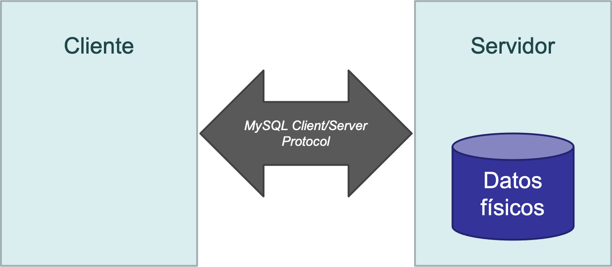
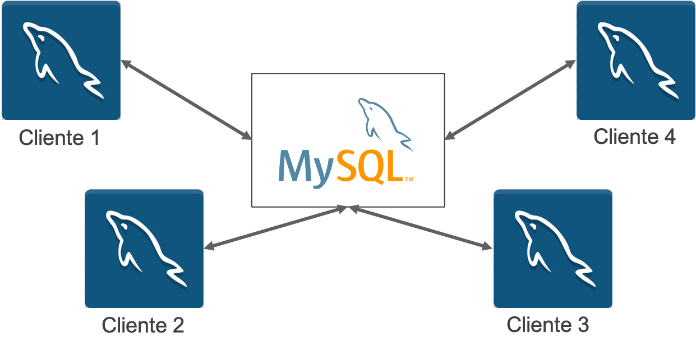
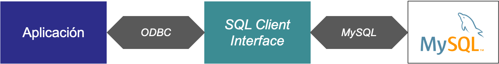

<style>

   .cite-author {
      text-align        : right;
   }
   .cite-author:after {
      color             : orangered;
      font-size         : 125%;
      font-weight       : bold;
      font-family       : Cambria, Cochin, Georgia, Times, 'Times New Roman', serif;
      padding-right     : 130px;
   }
   .cite-author[data-text]:after {
      content           : " - "attr(data-text) " - ";
   }

   .cite-author p {
      padding-bottom : 40px
   }

  s {text-decoration: underline; background-color: transparent}

  td {font-size: 0.8rem}
  thead {font-size: 0.8rem}

</style>

<!-- _class: titlepage -->


<div class="title">Tema 6</div>
<div class="subtitle">Acceso programático a bases de datos</div>
<div class="author">Grado en Ciencia de Datos e Inteligencia Artificial</div>
<div class="date">Curso 2021/2022</div>
<div class="organization">Departamento de Sistemas Informáticos</div>

[](https://creativecommons.org/licenses/by-nc-sa/4.0/)

---
<!-- _class: transition -->
# PROGRAMACIÓN CONTRA BASES DE DATOS

## Arquitectura cliente-servidor

---

# Arquitectura cliente-servidor

- Las bases de datos funcionan de acuerdo con una arquitectura cliente-servidor.
- El servidor, que contiene los datos, escucha las peticiones de los clientes.
- Los clientes solicitan al servidor que realicen operaciones sobre los datos: creación, actualización, borrado y consulta de los datos.
- Habitualmente, el servidor y los clientes se ejecutan en dispositivos físicos diferentes.

---

# MySQL Client/Server Protocol

Para comunicarse, el servidor y los clientes necesitan “hablar” el mismo idioma.

MySQL dispone de un protocolo que implementan tanto el servidor como los clientes para establecer la comunicación:

- Se denomina MySQL Client/Server Protocol.
- Se ejecuta sobre TCP.
- El cuerpo de los mensajes incluye sentencias SQL.

Más información en [la documentación de MySQL](https://dev.mysql.com/doc/internals/en/client-server-protocol.html).

---

# Esquema

Esquema básico de la arquitectura:

<center>


</center>

---

# Esquema con varios clientes

Lo habitual es que un mismo servidor reciba conexiones de diferentes clientes:

<center>


</center>

---

# Clientes de MySQL

- El cliente no tiene por qué ser **MySQL Workbench**.
- El cliente puede ser cualquier software que implemente el protocolo **MySQL Client/Server Protocol**.
- La mayoría de lenguajes de programación incorporan librerías (extensiones) para comunicarse con *MySQL* a través de clases y funciones de alto nivel.
- La base de datos es común para todos los programas. Cada programa se comunica con la base de datos a través de su conector:

---
<!-- _class: transition -->
# PROGRAMACIÓN CONTRA BASES DE DATOS

## Drivers nativos

---

# Open Database Connectivity

Open DataBase Connectivity (ODBC) es un estándar de acceso a las bases de datos.

El objetivo de ODBC es permitir el acceso a cualquier dato desde cualquier aplicación.

- Se crea una capa intermedia entre la aplicación y el SGBD.
- Esta capa actúa de traductor entre ODBC y el SGBD.
- Permite utilizar diferentes bases de datos sin cambiar la aplicación.



---

# pyodbc

`pyodbc` es un módulo de código abierto de Python que facilita el acceso a las bases de datos **ODBC**. Implementa la especificación *DB API 2.0*, pero incluye además funciones y características adicionales para facilitar el acceso a la información.

La forma más fácil de instalarlo es usar pip:

```bash
pip install pyodbc
```

Consulta la [documentación de instalación](https://github.com/mkleehammer/pyodbc/wiki/Install) para innformación adicional.

---

# MySQL Connector/ODBC

Para conectarnos a una base de datos **MySQL** mediante el protocolo ODBC es necesario instalar el driver específico que nos porporciona el fabricante.

Este driver será dependiende del sistema operativo desde el cual nos queramos conectar al sistema gestor de bases de datos y, por tanto, su [instalación](https://dev.mysql.com/doc/connector-odbc/en/) es diferente para cada SO.

Aunque usemos una librería específica de Python para conectarnos (**puodbc**), esta se basa en el conector oficial de **MySQL** para funcionar.

---

# pyodbc: cadena de conexión

Las conexiones a las bases de datos suelen apoyarse en la **cadena de conexión** para especificar los parámetros.

En el caso de ODBC, una cadena de conexión incluye información como:

- Versión del driver que se va a usar
- Host y puerto de comunicaciones
- Usuario y contraseña
- Codificación y otras opciones de la base de datos

---

# Conector oficial de MySQL para Python

En lugar de usar el conector ODBC, bastante complejo de instalar y configurar, vamos a usar una [librería propia](https://dev.mysql.com/doc/connector-python/en/) de MySQL para conectarnos al SGBD desde Python.

Podemos instalar el conector directamente desde `pip`:

```bash
pip install mysql-connector-python
```

La principal ventaja de este conector es que es autocontenido, no requiere descargarse el conector oficial ni librerías adicionales de Python.

---

<!-- _class: transition -->
# DEMO

## Conector oficial de MySQL
